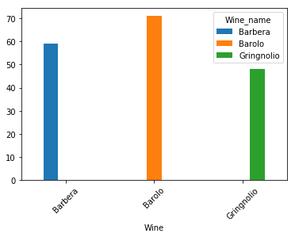
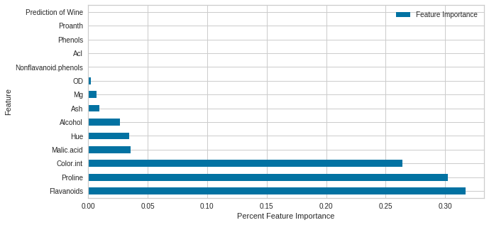
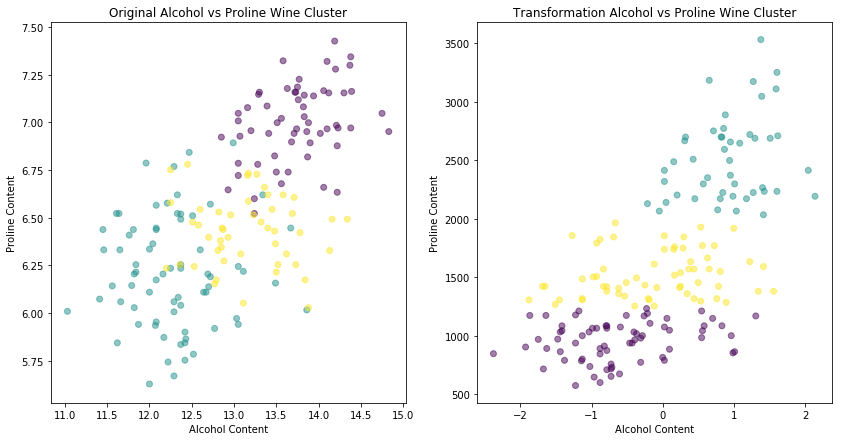

# Wine_Clustering_Classification
Wine Clustering Classification

With the Wine Clustering dataset we will use our machine learning models to help cluster classification on three diffferent wines:  Barbera, Barolo and Gringnolio.

The standard scaler and normalized wine1 set shows a much better result.

The model with the best score is Gradient Boosting Classifier with a socre of 97.2222%

The most used features utilized by the Gradient Boosting Classifier are Flavanoids, Proline and Color.

